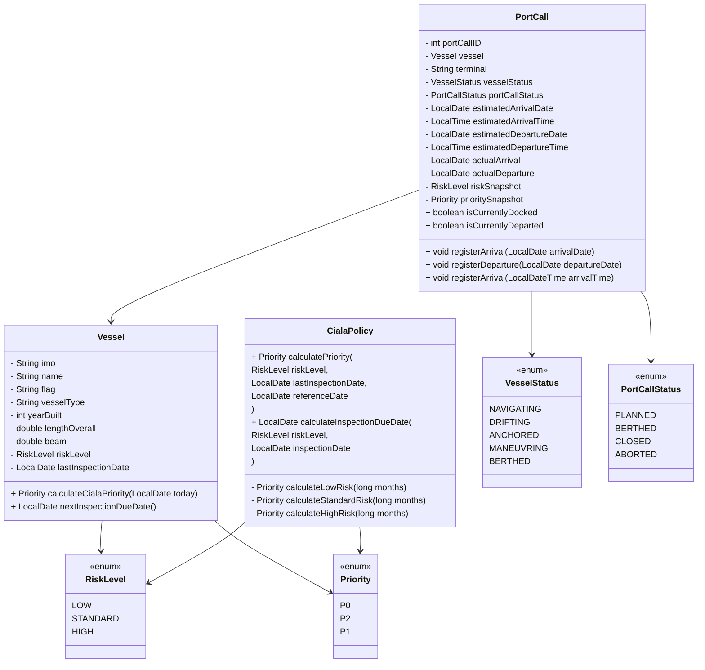
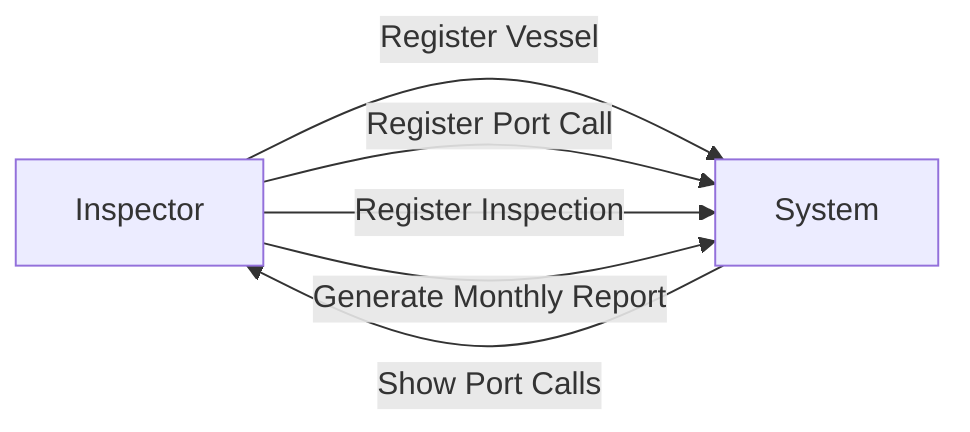

## Port Inspection Control

### 1. Visão Geral

Sistema interno para apoio ao Grupo de Vistoria e Inspeção (GVI) da Delegacia da Capitania dos Portos em Itajaí, com foco na automação da identificação de navios aptos à inspeção pelo Port State Control (PSC) e no registro de atracações e inspeções realizadas.

Projeto desenvolvido inicialmente para fins acadêmicos e de uso pessoal, com potencial de aplicação operacional interna.

---

### 2. Contexto Operacional

O sistema será utilizado por Inspetores Navais do GVI para:

* Registrar atracações de navios mercantes estrangeiros nos portos de Itajaí e Navegantes.
* Identificar automaticamente navios dentro da janela de inspeção PSC.
* Registrar inspeções realizadas.
* Acompanhar o percentual mensal de inspeções realizadas dentro da meta estabelecida.

Uso exclusivamente interno.

---

### 3. Objetivo do Sistema

Automatizar:

* Identificação de navios aptos à inspeção PSC.
* Registro de atracações.
* Registro de inspeções.
* Cálculo dinâmico de indicadores mensais.

---

### 4. Escopo

Inclui:

* Cadastro e atualização de navios (Vessel)
* Registro de atracações (PortCall)
* Registro de inspeções (Inspection)
* Cálculo automático de prioridade
* Identificação de janela de inspeção
* Relatórios mensais dinâmicos

Não inclui (fase inicial):

* Integração automática com ZP21
* Integração automática com CIALA
* Integração com SISGEVI
* Controle formal de workflow/aprovação

---

### 5. Requisitos Funcionais

RF01 – Cadastrar navio com dados técnicos e bandeira
RF02 – Atualizar data da última inspeção
RF03 – Calcular automaticamente prioridade com base em risco e tempo desde última inspeção
RF04 – Identificar se o navio está dentro da janela de inspeção
RF05 – Registrar atracação (PortCall)
RF06 – Registrar inspeção vinculada a uma atracação
RF07 – Gerar relatório mensal de atracações
RF08 – Gerar relatório mensal de inspeções
RF09 – Calcular percentual de inspeções realizadas dentro da janela

---

### 6. Requisitos Não Funcionais

RNF01 – Sistema web interno
RNF02 – Interface simples e objetiva
RNF03 – Arquitetura baseada em Spring Boot 3
RNF04 – Persistência via JPA/Hibernate
RNF05 – Banco H2 em desenvolvimento
RNF06 – PostgreSQL em ambiente de produção
RNF07 – Código versionado em Git
RNF08 – Ambiente padronizado via DevContainer

---

### 7. Modelo de Domínio Inicial

Entidades principais:

* Vessel
* PortCall
* Inspection

---

### 8. Diagrama de Classes



---

### 9. Diagrama de Casos de Uso



---

### 10. Roadmap Inicial

Fase 1 – Estrutura base e CRUD de Vessel
Fase 2 – Implementação de PortCall
Fase 3 – Implementação de Inspection
Fase 4 – Relatórios dinâmicos
Fase 5 – Controle de usuários e autenticação
Fase 6 – Possível integração futura com sistemas externos

---

### 11. Estrutura de Diretórios

```
src
 ├── main
 │    └── java
 │         └── br
 │              └── gov
 │                   └── psc
 │                        ├── domain
 │                        │     ├── policy
 │                        │     │     └── CialaPolicy.java 
 │                        │     ├── vessel
 │                        │     │     ├── Vessel.java
 │                        │     │     ├── RiskLevel.java
 │                        │     │     └── Priority.java
 │                        │     ├── portcall
 │                        │     |     ├── PortCall.java
 |                        |     |     ├── PortCallStatus.java
 │                        │     |     └── VesselStatus.java
 │                        │     └── service
 │                        │           └── PortCallService.java
 │                        └── PscApplication.java
 │
 └── test
      └── java
           └── br
                └── gov
                     └── psc
                          └── domain
                               ├── vessel
                               │     └── VesselPriorityTest.java
                               ├── portcall
                               |     └── PortCallTest.java
                               └──  service
                                     └── PortCallServiceTest.java   
```